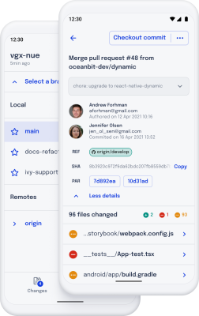
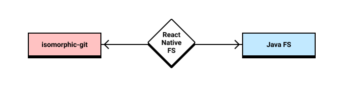

GitShark, our Git GUI that allows you to clone and commit from your mobile devices, is launching as a public beta on Android today!

With this release you can clone repos, make changes to files, make a commit right from your phone or tablet and push them back to your repos!

That said, with every release there's nuance to the journey it's taken thus far, what's available and what's still to come. Let's take a look at some of that.

 

## Initial Use Case

Despite various phrasings, we get the same question a lot: "Why?"

A lot of people don't understand why someone would want to use a Git client on their mobile devices. Let's take a look at the initial use-case that spurred [Corbin](https://crutchcorn.dev) to start development in the first place.

In May 2019, Corbin started the programming blog [Unicorn Utterances](https://unicorn-utterances.com). Wanting to encourage others to write, they decided to [open-source the project](https://github.com/unicorn-utterances/unicorn-utterances/), including the markdown files that are used to render the blog post contents. 

Around that same time, they were traveling a lot for work. While 16" laptops are great for screen real-estate, they're difficult to justify taking out during a plane. The sheer size doesn't conduce a good compact writing environment when seats are close and plane-neighbors are closer. Eventually, Corbin realized that they could use a smaller tablet with a keyboard attachment to make space lesser an issue while writing on the plane.

However, once they got off the plane, they realized they had to manually transfer the relevant files over to a laptop to push them to the Git repo that the blog was hosted on. Further, their iterative writing process was made more difficult without the ability to keep short-term temporary backups that could be rolled-back and managed respectively ala commits.

It was apparent at the time that what was needed was the full Git support they had on their desktop.

Unsatisfied with the available alternatives, Corbin took out to make their own. With mobile computing getting faster and faster every year, and with more and more people migrating to tablets as a major part of their workflow - it seemed to only make sense. We broke ground on GitShark on February 2020.

 

## Features

Before we take a look at what's upcoming that we have planned for the future, let's look at what can be done in the first Android Beta we're launching today:

- GitHub OAuth login - No manual user tokens required!
- Staging, unstaging
- Committing
- Pulling, push, fetch
- Creating branches
- Switching branches
- Checking out remote branches
- Viewing commit details
- Seeing a Git log for current branch
- Full accessibility support
- Translations in 4 languages
- Strong custom error handling with an easy-to-report interface

While we feel that this is a solid enough base to cover some initial usecases, we acknowledge that there's more to add to our app, such as:

- SAF support (support cloning to SD card)

- Branch Merging
- Checking out commits
- Tree view
- Interactive rebasing
- GitLab, BitBucket support
- Diff view

These are all things that we're planning to add before a full non-beta release.

We're not ones to rest on our laurels, however. As this blog post is being launched, our designers are working on revamping our design system to be more prepared for new features and design improvements and our developers are working on adding the branch merging feature we're hoping to include with the next release.

However, there's bound to be features that aren't listed here that you may want to see in the app. We're extremely open-minded and want to hear from you! Please [open a GitHub issue](https://github.com/oceanbit/GitShark/issues/new?assignees=&labels=&template=feature_request.md&title=%5BFEAT%5D+Feature+request) and tell us what you'd like to see!

 

## Other Platforms

While GitShark Android has seen a closed alpha come and go, and we're announcing an open beta of it today, we have not yet published an iOS closed alpha, nor have we started much development on our desktop versions. Let's walk through the technical reasons for the disjointed development and evaluate how we made the decision to prioritize Android as our first major platform.

 

### Technical Outline

If you've ever stopped by one of [Corbin's livestreams, where they build GitShark live on Twitch](https://twitch.tv/crutchcorn), you may already know that GitShark's UI is written in React Native. Because of this, many assume that we're able to build our app for iOS and Android at the same time. While this has some merit, GitShark has some reliance on native code that prevents us from being feature-complete between the two platforms day 1.

The biggest reason behind this is our dependency on native code. In GitShark Android, we nearly have 2K lines of code, and we anticipate that number to triple when rewriting to iOS. Why do we have that much native code in our React Native app? Why do we expect our iOS app to contain even more native code? Great questions. Let's start with the first one.

 

#### Why Native Code in a React Native App?

When building our MVP of GitShark back in last year, we started with a pure JavaScript implementation of Git called [`isomorphic-git`](http://isomorphic-git.org/). At first glance, this was perfect for us - `isomorphic-git` is well maintained, has an _**extremely**_ helpful creator (Sincerely, thank you so much for all of your help [William](https://twitter.com/wmhilton), GitShark wouldn't've made it without you), and the ability to use [a custom filesystem](https://isomorphic-git.org/docs/en/fs#implementing-your-own-fs). 

This last point is important, because we needed to plug [`react-native-fs`](https://github.com/itinance/react-native-fs) into our app to write the files that `isomorphic-git` told us to. With William's help, we were able to get a POC working relatively quickly, which we iterated upon in order to achieve our first few alphas.

The idea was that when `isomorphic-git` ran a command, when it wanted to write something to the filesystem, it would pass to `react-native-fs`, which would in turn be passed to Java. If `isomorphic-git` needed to read a file, it would request from `react-native-fs`, the Java FS would read the file, then pass it back to `isomorphic-git`.

However, once the app got in the hands of our testers, it was disastrous - the app crashed for some users with nearly every operation. Why was that?

When Git downloads data from the server, what it downloads is something called a ["packfile"](https://git-scm.com/book/en/v2/Git-Internals-Packfiles). This packfile is then used as a source-of-truth for various operations that might be done on a regular basis, specifically checking out a new branch. These packfiles that're retrieved during the initial clone are at least the size of the collective files in a branch (if shallow cloned).

It turns out that the React Native code bridge solution (from JavaScript to Java) did not support streaming. This meant that any time we wanted to read or write a file, the entire file's contents had to be read into memory. Even the [Unicorn Utterances](https://unicorn-utterances.com) repo that we wanted to do testing against had an initial packfile of ~300MB. The memory we're allowed to use on our testing device is 30MB before we hit an OOM error... We hit a lot of OOM errors.

**To be clear, the issues caused by our implementations had _nothing_ to do with `isomorphic-git`, `react-native-fs`, or any other libraries we used in our MVP** and instead were the fault of a lack of understanding around the limitations surrounding React Native's native code bindings on our end.

Because of this, we had to quickly rewrite anything that touched Git and replace `isomorphic-git` for [`JGit`](https://www.eclipse.org/jgit/) (a pure Java implementation of Git) and native code. 

Now that we understand _why_ we had to do this migration, let's look closer at why we chose JGit and how the story of writing native code will differ for our iOS release.

 

#### Native Git iOS vs. Native Git Android

As mentioned in the previous section all of our logic that touches the filesystem is written in native code. Anyone familiar with interfacing between Git in with other language bindings would likely encourage us to take a look at [`libgit2`](https://libgit2.org): a portable C implementation of Git core methods that's used in production by GitHub, GitLab, BitBucket, Microsoft, and many many more.

We actually looked into `libgit2` when comparing options for Android. On top of having difficulties getting it to compile under the [NDK](https://developer.android.com/ndk) (Android's C compiler/bindings), we also found that even the most popular Java bindings to `libgit2` [seemed immature](https://github.com/ethomson/jagged) compared to [other language bindings](https://github.com/libgit2/objective-git).

While `libgit2` may be the play to make in the long-term, and we'll be using it for our iOS release (using the much more mature and official [`objective-git`](https://github.com/libgit2/objective-git) language bindings), it doesn't seem like the right move for now.

Further, while working on our iOS alpha, we found that `libgit2` simply doesn't provide the same level of high level and "porcelain" level APIs that JGit does. What this means is that, while `libgit2` may handle some of the foundation, it doesn't provide commonly-used commands such as [status](https://libgit2.org/libgit2/ex/HEAD/status.html), [log](https://libgit2.org/libgit2/ex/HEAD/log.html), [merge](https://libgit2.org/libgit2/ex/HEAD/merge.html) and others that JGit does. Because of this, functionality that we get out-of-the-box with JGit we'll need to write by hand in Objective-C for our iOS release.

 

### Why Android First?

While we've already touched on some of the difficulties we'll expect to run into with our iOS release compared to our Android release in the previous section, this isn't why we chose to go with Android first.

Let's first start by looking at the ecosystems for Android, iOS, and desktop:

- Android has only two alternatives as far as we can tell: one paid, one free and open-source
  - Paid one has not been updated in over 4 years, has confusing UX in our experience
  - Open-source one has been maintained significantly better, has a fantastic community and is stable
    - However, it lacks a tablet UI and many of the more advanced features (like a tree view or interactive rebase) are not yet present
- iOS has at least one major alternative
  - Widely used
  - Contains multiple more features than we do
- Desktop has easily dozens of alternatives
  - Most contain significantly more features
  - Have multiple years of head start

Looking at things this way, it seems clear which platform is in the most immediate need of a tool like GitShark. However, we're not going off of intuition alone - we have data to back up our decisions.

When we announced GitShark, we launched a [public-facing marketing site](https://gitshark.dev) alongside of it. Towards the top of the page was a sign-up list for when we released the product.

- 70% of people who signed up for our mailing list chose "Android" as the platform they were interested in.

- iOS tied with Windows at 38%. 

- macOS came in last at 27%

> Some of you may be thinking "that's more than 100%", which is correct. Keep in mind that our mailing list allowed you to pick multiple platforms

 

## A Word From Us

This experience has been quite the journey for us. For me, it's been my first startup, my first mobile app, and the biggest coding project I've worked on in my own time. While this journey is just getting started, it's fun to reflect on what we've accomplished so far and everyone that's been there along the way.

I'd personally like to offer a special thanks to:

- [Ed Pratti](https://twitter.com/edpratti), our lead design for OceanBit - we wouldn't've made it 1/10th as far as we did without him
- [Sean Miller](https://twitter.com/BeastoSean), who was by far the most helpful tester of our app
- [William Hilton](https://twitter.com/wmhilton), who practically created our MVP for us in our first few months
- [Evelyn Hathaway](https://twitter.com/eeveedev), who helped us deploy our web infrastructure and endured our annoying requests therein
- [Jahir Fiquitiva](https://twitter.com/jahirfiquitiva), who provided the Spanish translation of our app
- [Jacob Schneider](https://github.com/J-Cake), who, unprompted, dropped an initial translation of German for us
- Everyone who participated in [my livestreams](https://twitch.tv/crutchcorn) while I was building the app and encouraged us to keep going
- You, for taking the time and reading through this

We're excited (and nervous) for the beta to launch today, and we hope you'll see the love and effort we've poured into this project.

\- Corbin Crutchley, CEO & Developer
