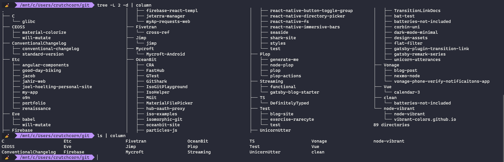
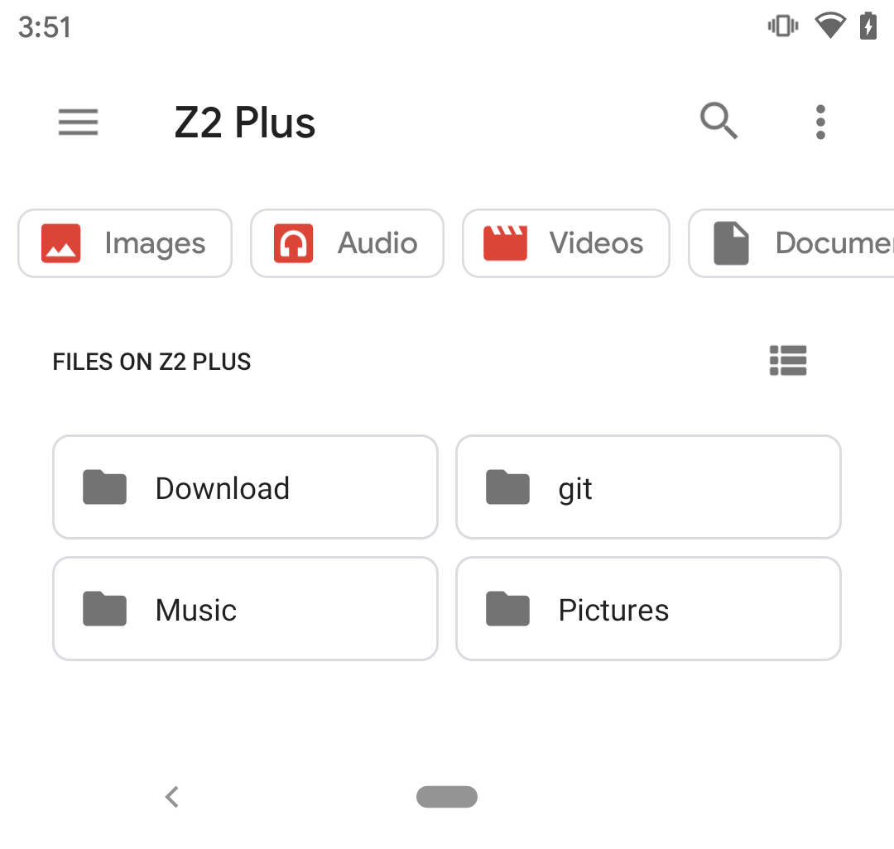
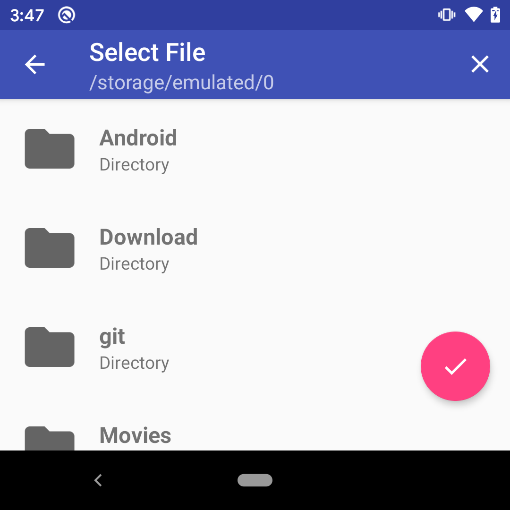
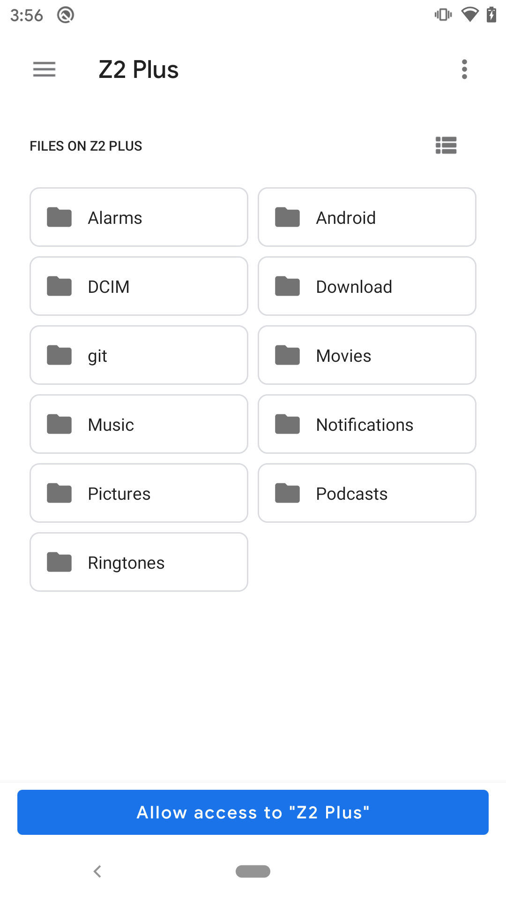
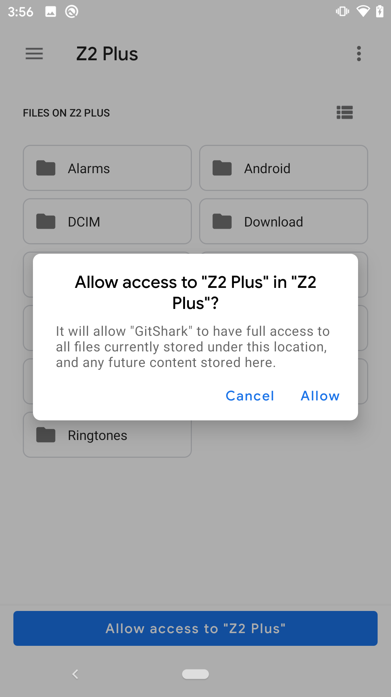

If you're familiar with our [Android Git Client - GitShark](https://gitshark.dev), you may have noticed the following dialog show up when trying to clone a new repo:


The idea behind this dialog is simple:

- Enter the URL for the `origin` remote
- Select the parent folder to clone the repo into
- Optionally give the repository a name

This functionality may seem simple, but one particular part of this feature set has caused us a fair bit of trouble: Directory selection.

## Why We Want This Feature

First, before we dive into the technical aspects, let's provide some background on why this functionality might be useful. I'm a huge proponent of open source software. If I'm not working, odds are that you'll find me either reading through some upstream software's source code or contributing to another project. As such, these are all of the projects I've worked on in the past few months:



Yup! That's 89 distinct directories - each one of them with their own codebase! Not all of them I've contributed to, and many of them are small-time projects or one-off clones to help a friend debug. This is my main development desktop. I also have a laptop that occationally work off of, which has many many fewer folders for development.

In order to maintain order amonst this file system chaos, I have parent folders, generally outlining the projects that I'm utilizing the respective projects for. You'll notice a lot of GitShark's React Native dependencies under `OceanBit` to keep them all in one place. That way, when I run `ls` in `~/git/OceanBit`, I find myself seeing only the relevant projects to GitShark instead of [`o9n`](https://github.com/chmanie/o9n), an unrelated dependency from an old project of mine.

## The Android Version

With the understanding that we'd like to enable that functionality in GitShark, and with the initial goal to make an Android app, we marked out to enable this functionality. Because Android doesn't have standard file paths for apps to store their data, we knew we'd have to enable a user to, at very least, select a folder to contain their cloned repos into. However, we took it a step further, an enable users to pick individiaul folders for each repo they clone. 

As you can see below, there's nothing stopping a user from creating a `git` folder and storing their repos in the same way I do on my desktop:

<div class="imgborder">



</div>

However, because Android has had file management for such a long time, there's more than one way to select a file. Currently, our app uses [a library - MaterialFilePicker](https://github.com/oceanbit-dev/MaterialFilePicker) to select directories. This library creates a directory picker UI that looks something like this:

<div>



</div>

However, as of Android 4.4 (API level 19), Android has had an official method for selecting folders. Part of the "Storage Access Framework" (SAF), you can simply run the following code:

```java
Intent intent = new Intent(Intent.ACTION_OPEN_DOCUMENT_TREE);
intent.putExtra(Intent.EXTRA_LOCAL_ONLY, true);
activity.startActivityForResult(intent, RQS_OPEN_DOCUMENT_TREE);
```

And find yourself with an SAF directory picker, complete with warning of app permissions when a folder is selected:

<div style="display: flex;">

<div style="width:300px;margin:10px 0 10px 10px;" class="imgborder imgcontainer">



</div>

<div style="width:300px;margin:10px 0 10px 10px;" class="imgborder imgcontainer">



</div>

</div>

You'll notice the major distinction between the native directory  picker and the library-based directory picker. The library directory picker doesn't exactly match the aesthetic of GitShark, nor does is respect system dark mode. For these reasons (and more), we wanted desperately to utilize SAF for GitShark. Let's evaluate it as an option.


### Why We Can't Use SAF Today

TL/DR: `react-native-fs` doesn't work with 


### Why We Can't Use Legacy Filesystems Tomorrow

After seeing the cons of SAF, you may ask yourself "why don't you stay with MaterialFile and use the legacy filesystem for the forseeable future?" Well, this is where the problems come into play.


### Why We Can't Use Another Option


## The iOS Version


<div style="display: flex;">

<div style="width:300px;padding:10px 0 10px 10px;">


</div>

<div style="width:300px;padding:10px 0 10px 10px;">


</div>

<div style="width:300px;padding:10px 0 10px 10px;">


</div>

</div>


Without checking, can you tell which one is which? Even if you can, do you expect there to be major UX differences between each with just how similar they are to one-another?


We were left with a question:

>"Do we delay the app's release for potentially months while we work on replacing every instance of `isomorphic-git` and `react-native-fs`? Can we even justify that course while we're not even certain that `SwiftGit2` supports the 'unlocked' FS path? Is this niche feature worth the extra development time? Will our users even be able to utilize functionality?"

We took a step back, and analyzed. As far as we're aware, there are no iOS IDEs that support opening arbitrary folders from the device's FS. (If you're aware of any, please [reach out to us on Twitter](https://twitter.com/oceanbit_dev), we'd love to learn about a new app!)
