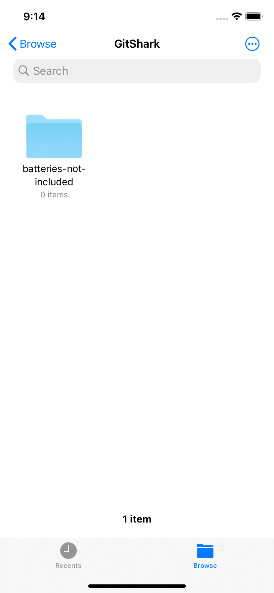
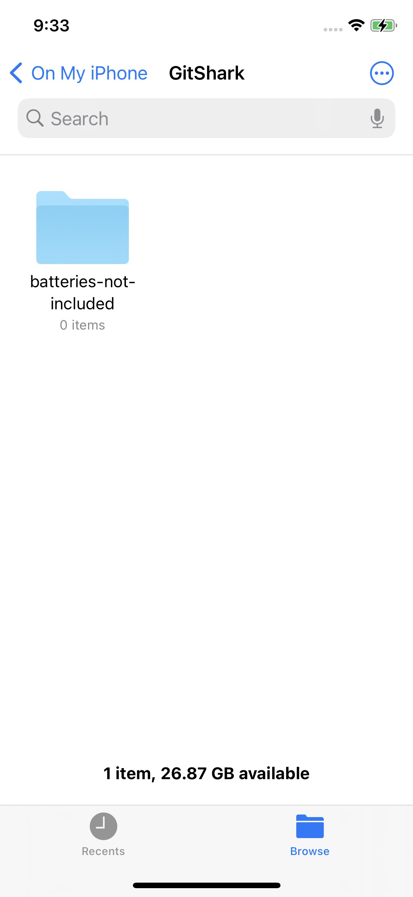
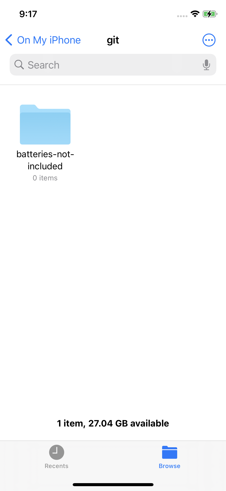

If you're familiar with our Android app, you may have noticed the following 

Without checking, can you tell which one is which? Even if you can, do you expect there to be major UX differences between each with just how similar they are to one-another?

We were left with a question:

>"Do we delay the app's release for potentially months while we work on replacing every instance of `isomorphic-git` and `react-native-fs`? Can we even justify that course while we're not even certain that `SwiftGit2` supports the 'unlocked' FS path? Is this niche feature worth the extra development time? Will our users even be able to utilize functionality?"

We took a step back, and analyzed. As far as we're aware, there are no iOS IDEs that support opening arbitrary folders from the device's FS. (If you're aware of any, please [reach out to us on Twitter](https://twitter.com/oceanbit_dev), we'd love to learn about a new app!)
